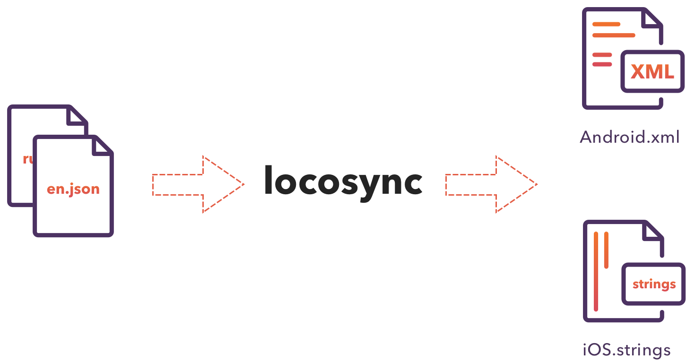

Tool to easely making localization for iOS and Android from shared source

Supports both 2 and 3 python versions

# Get started

#### Prepare source

At first you need to make directory with localization sources. Source for each language is simple key-value JSON like:

```json
{
	"score" : "Score",
	"points" : "You got %s points"
}
```

Here is [example source directory](example)

#### Configure output paths

Next, you need setup output paths. Make in source directory `localization.json` file like:

```json
{
	"ios_path" : "../IosProject/",
	"android_path" : "../AndroidProject/app/src/main/res"
}
```
It supports absolute and relative paths

#### Run

Finally, just run locosync

```bash
./locosync.py %localization_source_dir%
```

## Additional features

You can setup platform-specific strings:
```json
{
	"string__android" : "This string will be included only in Android", 
	"string__ios" : "This string will be included only in iOS"
}
```

